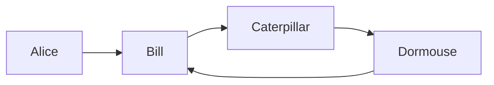
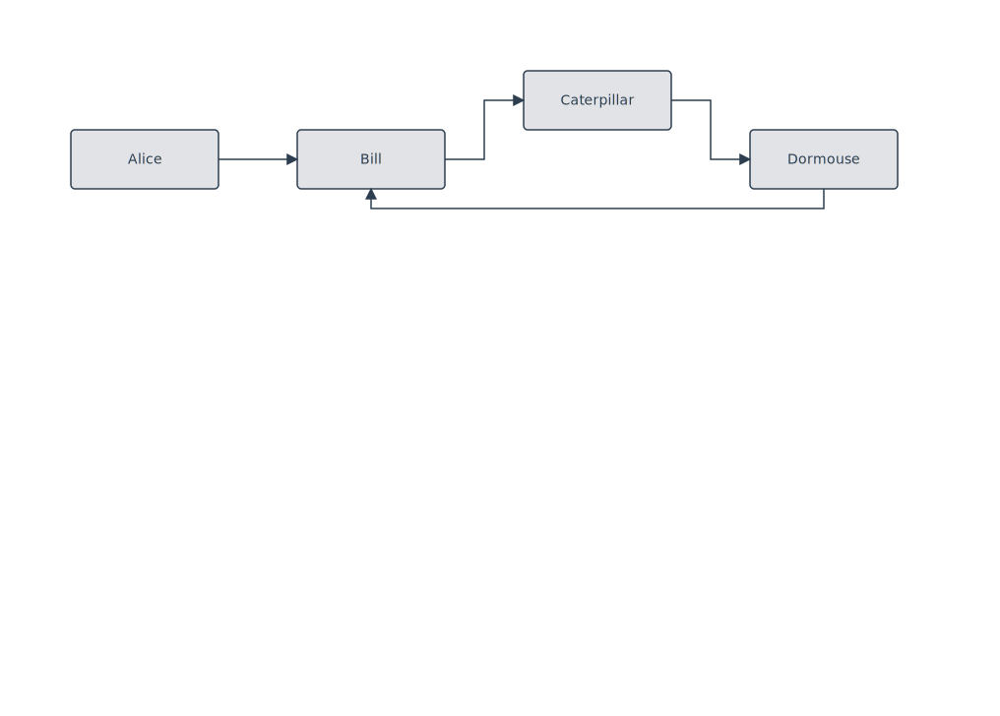
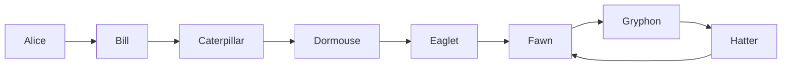
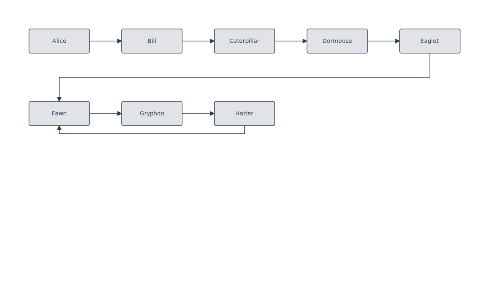

# Rule: back-edge-gutter-routing

## Statement

In horizontal layouts (LR / RL), back-edges and visually-back forward edges (row-wrapped) route through the gutter **below** the source row, never through exterior space above row 1.

Port assignment by `dy = target.y − source.y`:
- **Same row** (`|dy| ≤ threshold`): src **Bottom**, tgt **Bottom**. The edge dips into the gutter below the row and rises back to the target.
- **Target below source** (`dy > threshold`, the row-wrap case): src **Bottom**, tgt **Top**. The edge uses the gutter *between* the source row and the target row.
- **Target above source** (`dy < −threshold`, rare): src **Top**, tgt **Bottom**. Uses the gutter from the other direction; left in place for completeness, not the canonical case.

## Rationale

When a reader scans a horizontal flowchart top-down and left-to-right, **the area above row 1 is exterior** — there's nothing up there to anchor a routing line, so a back-edge drawn over the top of row 1 reads as "this line escapes the diagram and reappears." Gutters between rows are **interior**: they sit naturally in the reader's scan path and read as "this is a detour through space I've already covered."

The geometry follows from the mental model: forward flow is the *surface* of the diagram, back-edges are *tunnels* beneath it. Each tunnel uses the nearest gutter below its source — same-row loops use the gutter immediately below; cross-row visually-back edges use the gutter between the rows they span. Depth grows naturally with the span of the back-edge, so big loops read as visually further away.

Two routing pathologies this prevents:
1. **Wrap-above-row-1** for row-wrapped forward edges. The legacy port assignment exited the source through its Top face, routing the polyline over the top of row 1 through exterior space.
2. **Slides-along-target-bottom** for same-face back-edges. The `Bottom` case of `sameFaceDetour` always used a 5-segment side-detour, even when source and target were horizontally separated. Mirrored the `Top` 3-segment optimization so the last segment enters perpendicularly through the row gap.

## Examples

### Same-row back-edge





`Dormouse → Bill` is the back-edge. Source port on Dormouse's **Bottom**, target port on Bill's **Bottom**. The polyline drops 20 px into the gutter, runs left, and rises perpendicularly into Bill's bottom face. Forward edges keep their natural Right→Left in-flow alignments.

### Row wrap + cycle (both cases in one fixture)





Two distinct routings, same rule:
- `Eaglet → Fawn` is forward in the DAG but visually-back after the 8-node chain wraps to a second row. Target is below source → src **Bottom**, tgt **Top**. The polyline uses the gutter *between* row 1 and row 2.
- `Hatter → Fawn` is a true back-edge in the DAG, same row. Both faces are **Bottom**. The polyline dips below row 2 and rises back up.

Both polylines end with a vertical segment, entering the target perpendicularly.

## Tests

- Minimal same-row fixture: [`packages/doodles-svg/test/golden/fixtures/lr-back-edge-gutter.mmd`](../../packages/doodles-svg/test/golden/fixtures/lr-back-edge-gutter.mmd)
- Wider fixture covering both same-row and row-wrap: [`packages/doodles-svg/test/golden/fixtures/lr-back-edge-wrap.mmd`](../../packages/doodles-svg/test/golden/fixtures/lr-back-edge-wrap.mmd)
- Describe blocks: `golden: lr-back-edge-gutter` and `golden: lr-back-edge-wrap` in `golden.test.ts`
- Key assertions (DSL methods `hasSourceAlignment` / `hasTargetAlignment`):
  - `loaded.L.edge({fromText: "Dormouse", toText: "Bill"}).hasSourceAlignment(PortAlignment.Bottom).hasTargetAlignment(PortAlignment.Bottom);`
  - `loaded.L.edge({fromText: "Eaglet", toText: "Fawn"}).hasSourceAlignment(PortAlignment.Bottom).hasTargetAlignment(PortAlignment.Top);`
  - `loaded.L.edge({fromText: "Hatter", toText: "Fawn"}).hasSourceAlignment(PortAlignment.Bottom).hasTargetAlignment(PortAlignment.Bottom);`

## Implementation

Two changes:
1. **Port assignment** — `lrBackEdgeFaces(dy)` in [`packages/doodles-layout/src/structureRelayout.ts`](../../packages/doodles-layout/src/structureRelayout.ts). Picks the face pair based on dy sign (same row / target below / target above).
2. **Edge routing** — `sameFaceDetour` for `PortAlignment.Bottom` in [`packages/doodles-svg/src/routing.ts`](../../packages/doodles-svg/src/routing.ts) now mirrors the `Top` case's 3-segment optimization when source and target are horizontally separated — the canonical LR back-edge shape.

## Anti-example

Before this rule, the same row-wrap input rendered the cross-row visually-back edge over the top of row 1:

```
   ┌─────── back-edge slices over exterior space above row 1 ────────┐
   │                                                                  │
   ▼                                                                  │
[Alice] ──► [Bill] ──► ... ──► [Eaglet] ─ forward in DAG ─────────────┘
                                              wraps to row 2
[Fawn] ──► [Gryphon] ──► [Hatter] ─────────► [Fawn]
```

The reader sees a line that exits the diagram, runs across the top margin, and re-enters from the left — there's no mental anchor for what that line "means" because the path is in space the diagram doesn't otherwise occupy. The gutter-routed version reads as "go down into the next row's gap, run back, come up" — every segment is interior.

## Limits

- TB / BT layouts: not covered by this rule. Decision-diamond branches in vertical layouts have different semantics — both branches go *down*, neither stays on the row.
- "Target above source" cross-row case (`dy < −threshold`): handled with `src Top, tgt Bottom` as a placeholder. We don't have a fixture for it yet; revisit when a real diagram surfaces it.
