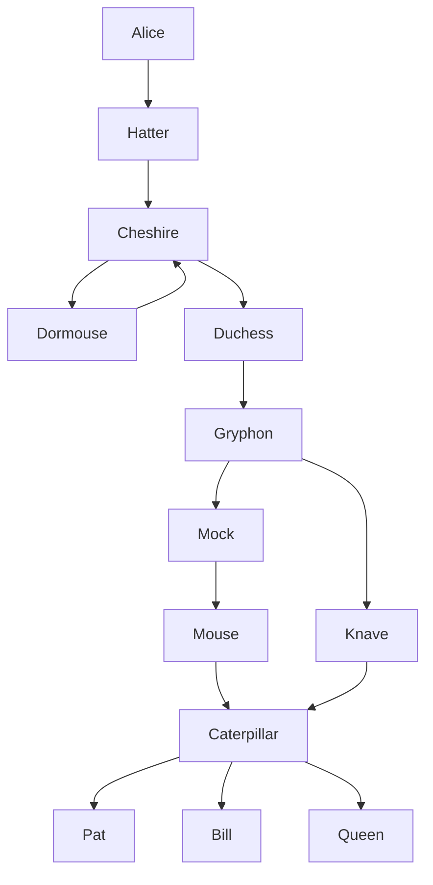
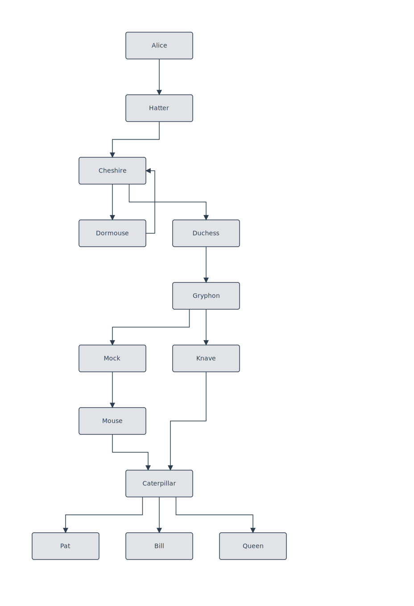

# Rule: back-edge-stacked-column-riser

## Statement

When a same-face back-edge (both ends on the **Left** or both on the **Right** face) connects two nodes that are **stacked vertically in one column**, the return path is a tight 4-point riser just outside the shared face — step out perpendicular, run straight to the target's port height, step back in. It does **not** loop up over the top (or down under the bottom) of the whole stack.

The rule fires when the two ports' vertical separation exceeds their combined half-height (`|from.y − to.y| > (srcH + tgtH) / 2`). Horizontally-separated same-face pairs (side by side) keep the loop-over/under detour — there the side step alone doesn't clear both boxes.

## Rationale

A 2-cycle inside a wider pipeline (`Cheshire ↔ Dormouse`, with downstream weight aligning them in one column and a right sibling `Duchess`) gets a Right face on both ends of the back-edge. The same-face U-detour was written for the side-by-side case: escape past the shared face, then run the cross-leg *above or below the combined bbox* before bending back in.

For a **stacked** pair that overshoots badly. The cross-leg is forced to `min(tops) − pad`, above the upper node, so the edge rises past the top of the whole stack, crosses over, then **slides straight down the upper node's border** into its port — a tall vertical line hugging the column and entering parallel to the face instead of perpendicular. Visually it reads as a long stray riser beside the pipeline.

Escaping to the side already clears both boxes when they share a column, so the cross-leg only needs to reach the target port's y — no vertical overshoot. This is the vertical mirror of the `horizontalGap` short-circuit the Top/Bottom branches already apply. The obstacle-aware reroute pass (`rerouteAroundObstacles`) remains the safety net if the tight riser column is occupied.

## Example

`Cheshire → Dormouse` closes into a 2-cycle. The downstream fan (`Duchess` and its subtree) aligns `Cheshire` and `Dormouse` in one column with `Duchess` as the right sibling, so the back-edge lands Right → Right. The tight riser steps out to just past the shared right edge, runs straight up to `Cheshire`'s right-port y, and enters perpendicular — no climb above `Cheshire`'s top.

## Test

- Fixture: [`packages/doodles-svg/test/golden/fixtures/tb-back-edge-stacked-column.mmd`](../../packages/doodles-svg/test/golden/fixtures/tb-back-edge-stacked-column.mmd)
- Describe block: `golden: tb-back-edge-stacked-column` in `golden.test.ts`
- Key assertions:
  - `loaded.L.edge({fromText: "Dormouse", toText: "Cheshire"}).polylineLengthAtMost(4);` — tight riser, not a 5-point loop.
  - `loaded.L.edge({fromText: "Dormouse", toText: "Cheshire"}).entersTargetPerpendicularTo(PortAlignment.Right);` — enters the face, not sliding down its border.
  - `loaded.L.nodes("Cheshire", "Dormouse").sameColumn();` — precondition: the pair is stacked.

## Implementation

`sameFaceDetour` in [`packages/doodles-svg/src/routing.ts`](../../packages/doodles-svg/src/routing.ts). The `Right` and `Left` branches short-circuit to `[from, {outerX, from.y}, {outerX, to.y}, to]` when `verticalStack(from, to, srcBounds, tgtBounds)` holds; otherwise they fall through to the existing above/below loop. `verticalStack` is the y-axis mirror of the `horizontalGap` test used by the `Top`/`Bottom` branches.

## Limits

- **Side-by-side same-face pairs**: unchanged — they still loop above/below, since a side step alone wouldn't clear both boxes.
- **Top / Bottom faces**: already handled by their own `horizontalGap` short-circuit; this rule only adds the Left/Right mirror.
- **Occupied riser column**: if the tight riser's column is blocked (e.g. a sibling in the gap), `rerouteAroundObstacles` repairs it downstream — this rule picks the ideal path, not the collision-checked final one.
