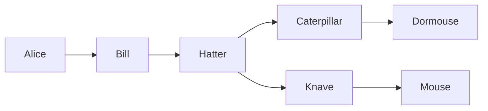
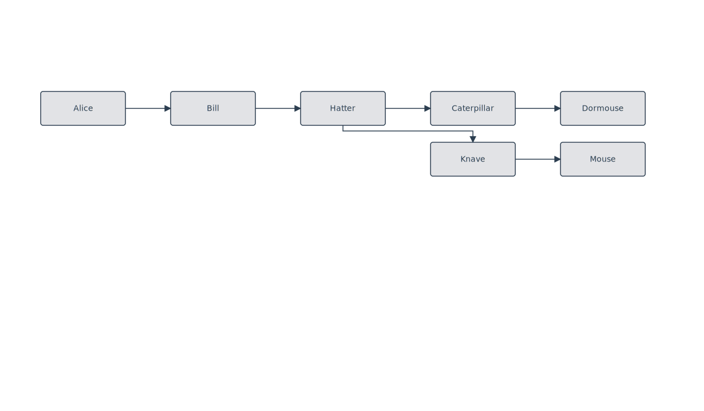

# Rule: fork-cross-row-perpendicular-exit

## Statement

In horizontal layouts (LR / RL), when a source node has out-degree ≥ 2 **and** one of its outgoing edges crosses to a different row (`|dy| > 70 px`), that cross-row branch exits the source's **cross-axis** face (Bottom for target below, Top for target above) instead of the in-flow face (Right for LR).

The in-row branches keep their natural Right (or Left) face. The rule does not apply to single-out-degree sources (no port-conflict to resolve), to cross-cluster edges (`applyCrossClusterExitFace` handles those with obstacle-aware blocked-face detection), or to TB / BT layouts.

## Rationale

Two forces meet at a fork:

1. **The in-row branch wants the row's principal direction.** For LR, that's Right — pointing the way the reader is scanning. Forcing it through Bottom is wrong; that branch isn't "changing rows."
2. **The cross-row branch wants its destination row.** Routing it through Right and bending mid-air produces an L that competes with the in-row branch for face space, *and* runs through the same horizontal channel where any incoming back-edge would land.

The user-visible failure case: a node with `(in-row out-edge, cross-row out-edge, incoming back-edge)` all on the same face. The back-edge's leftward run in the gutter crosses the cross-row edge's vertical descent. With this rule, the cross-row edge moves to the Bottom face, and port distribution orders it on the *left* side (toward the cross-row target) while the incoming back-edge naturally sorts to the *right* (toward the back-edge's source). Their polylines occupy disjoint x-ranges → no crossing.

A simpler way to state it: the in-flow face is for *continuing along the row*; the cross-axis face is for *changing rows*. A fork branches the flow, so its branches differ in *what they're doing* — one continuing, one changing — and should differ in *which face they exit*.

## Example

`Hatter` is the fork. `Hatter → Caterpillar` is the in-row continuation (Right → Left, same row). `Hatter → Knave` is the cross-row branch: source port on **Hatter's Bottom**, target port on **Knave's Top**. The polyline drops perpendicularly into the gutter, runs across to Knave's column, then drops into Knave from above.

(The `nodespacing: 120` frontmatter forces an actual gutter between the two rows so the perpendicular detour has room to render — without it, filigree stacks the rows with zero gap and the Bottom→Top edge degenerates to a horizontal line.)

## Tests

- Minimal fixture: [`packages/doodles-svg/test/golden/fixtures/lr-fork-cross-row.mmd`](../../packages/doodles-svg/test/golden/fixtures/lr-fork-cross-row.mmd)
- Real-world regression fixture: [`packages/doodles-svg/test/golden/fixtures/lr-cycle-with-back-edges.mmd`](../../packages/doodles-svg/test/golden/fixtures/lr-cycle-with-back-edges.mmd) — covers the `Supervisor → Followups` case that motivated the rule (fork in row 2 with cross-row branch to row 3, alongside an incoming back-edge from the cycle).
- Describe blocks: `golden: lr-fork-cross-row` and `golden: lr-cycle-with-back-edges` in `golden.test.ts`
- Key assertions:
  - `loaded.L.edge({fromText: "Hatter", toText: "Knave"}).hasSourceAlignment(PortAlignment.Bottom).hasTargetAlignment(PortAlignment.Top);`
  - `loaded.L.edge({fromText: "Hatter", toText: "Caterpillar"}).hasSourceAlignment(PortAlignment.Right);` *(in-row branch stays put)*

## Implementation

`applyCrossRowForkExit` in [`packages/doodles-layout/src/structureRelayout.ts`](../../packages/doodles-layout/src/structureRelayout.ts), run after `applyDecisionNodeConvention` and before `applyCrossClusterExitFace`. Iterates assignments, counts outgoing per source, and for each fork's in-flow-face edge with `|dy| > FORK_PERPENDICULAR_EXIT_MIN_DY_PX` flips to the cross-axis face. Cross-cluster edges are left alone — `applyCrossClusterExitFace` already runs obstacle-aware blocked-face detection on them.

## Why the threshold

`FORK_PERPENDICULAR_EXIT_MIN_DY_PX = 70` sits in the narrow gap between two cases:

- **Touching rows** (gap = 0, dy = node height = 60). Filigree's layered algorithm sometimes stacks intra-column nodes with no gap. A Bottom→Top edge here degenerates to a single horizontal line at the boundary, indistinguishable from "the row separator." Threshold must exclude this.
- **Real gutter** (dy ≥ ~90, gap ≥ 30). The `pivotBetweenContainers` router has 20 px of clearance pad — once the gutter exceeds it, the perpendicular detour produces a clean 4-segment polyline.

70 sits between 60 (excluded) and 90 (included). Adjust if filigree's spacing math changes.

## Limits

- **Single-out sources**: rule doesn't fire. An L-bend off the Right face is fine when nothing else competes for that face.
- **Cross-cluster fanout**: handled separately by `applyCrossClusterExitFace`, which checks for sibling-blocked faces. Skipping cross-cluster edges here avoids racing past that check and routing through a sibling.
- **TB / BT layouts**: rule doesn't fire. Vertical decision diamonds already branch via `applyDecisionNodeConvention`.
- **Same-row forks**: rule doesn't fire (no row change). Multi-port distribution on the in-flow face handles those via port sort order.

## Relation to back-edge-gutter-routing

This rule and [`back-edge-gutter-routing`](./back-edge-gutter-routing.md) are siblings — both implement the principle *"cross-row edges exit the cross-axis face."* The difference is who's covered:

- `back-edge-gutter-routing` covers **back-edges** (dx < 0 in LR): cycles and row-wrap-induced visually-back forward edges.
- `fork-cross-row-perpendicular-exit` covers **forward cross-row edges from forks** (dx > 0, |dy| > threshold, outdeg ≥ 2).

Together they ensure every edge changing rows in an LR layout takes the cross-axis face, regardless of direction or topology.
