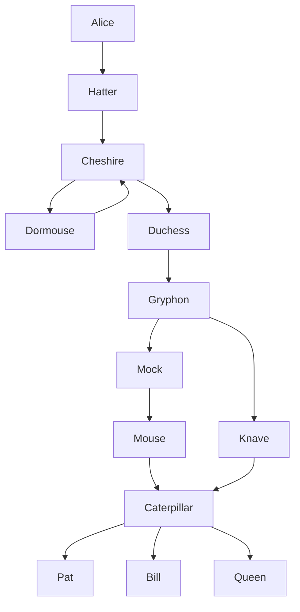

# Rule: fork-straight-spine-port

## Statement

When a node has several edges leaving the same face and exactly one of their targets is **centre-aligned** with the source across that face (a target directly below for a Bottom face, directly across for a Right face, etc.), that edge's port is pinned to the **face centre (50%)** so it runs perpendicularly straight. The remaining siblings distribute evenly within the half of the face on their own side.

With no centre-aligned target, all ports keep the even `(i+1)/(n+1)` spread. With more than one centre-aligned target (rare), the even spread is kept too — only a single unambiguous spine is straightened.

## Rationale

Port distribution fans a node's same-face edges across the face at evenly-spaced ratios (two edges → 33% / 67%). That reads well for a symmetric fan, but when one child sits directly in line with the parent — the common "pipeline spine with a branch off to the side" shape — the even spread pushes the spine edge off-centre, so it leaves at 33%, kinks, and doglegs back to the child's centre. The main flow, the thing the eye should follow straight down, is the one edge that bends.

Pinning the aligned edge to the centre makes the spine a single straight segment and moves the doglegs onto the branch edges, where a bend is expected (they're going sideways anyway). The sort already orders the aligned port between the two direction groups, so the siblings split cleanly into a left/up half and a right/down half and distribute inside their own half around the centre.

The straightening is purely a port-ratio choice; obstacle-aware rerouting still runs afterward, so a pinned spine that would collide is still repaired downstream.

## Example

`Cheshire` has two Bottom-face out-edges: `Dormouse` (directly below, same column) and `Duchess` (to the right). `Cheshire → Dormouse` is pinned to the 50% port and runs straight down; `Cheshire → Duchess` distributes to 75% and elbows toward its column. The same shape recurs at `Assemble → Embed` (straight) vs `Assemble → Detect communities` (branch) in the real pipeline this fixture anonymizes.

## Test

- Fixture: [`packages/doodles-svg/test/golden/fixtures/tb-back-edge-stacked-column.mmd`](../../packages/doodles-svg/test/golden/fixtures/tb-back-edge-stacked-column.mmd) (shared with `back-edge-stacked-column-riser` — the back-edge coupling is what aligns the fork).
- Describe block: `golden: tb-back-edge-stacked-column` in `golden.test.ts`
- Key assertions:
  - `loaded.L.edge({fromText: "Cheshire", toText: "Dormouse"}).polylineLengthAtMost(2);` — spine is a straight 2-point segment, no dogleg.
  - `loaded.L.edge({fromText: "Cheshire", toText: "Duchess"}).hasSourceAlignment(PortAlignment.Bottom);` — the branch keeps its Bottom face (only the ratio moved, not the face).

## Implementation

`portRatiosForFace` in [`packages/doodles-layout/src/structureRelayout.ts`](../../packages/doodles-layout/src/structureRelayout.ts), used by `distributePortsAlongSides`. `buildPortSortInfo` flags a port `axisAligned` when the target's centre matches the source's along the face's cross axis (within `PORT_AXIS_ALIGN_TOLERANCE_PX`). If exactly one port on a face is aligned, `portRatiosForFace` returns 50% for it and distributes the before/after siblings evenly in the (0, 50) / (50, 100) halves; otherwise the even `(i+1)/(n+1)` spread.

## Limits

- **Two or more aligned targets on one face**: falls back to even spread — there's no single spine to straighten without overlapping ports.
- **Alignment tolerance**: centres must match within 2 px. Layered placement aligns columns exactly, so a near-miss (different node widths, off-grid) is treated as a branch, not a spine.
- **Collision**: pinning is geometric, not obstacle-checked. If the straight spine would pierce a node, `rerouteAroundObstacles` (doodles-svg) still repairs it — this rule only chooses the ideal port.
