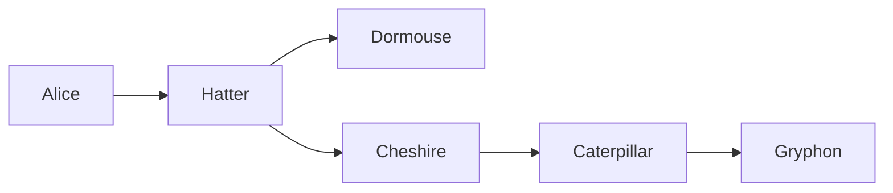
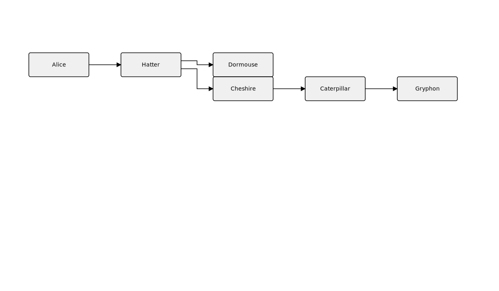

# Rule: linear-tail-after-fork

## Statement

In horizontal layouts (LR / RL), at every fork node `F` (out-degree ≥ 2): the **first-declared** child sits on `F`'s row, and that pinning propagates forward through its linear continuation. Every other child starts its **own** row at the child's natural y, and its linear chain stays pinned to that row.

A "linear continuation" walks forward as long as the next node has exactly one in-edge and one out-edge. It stops at the next fork, the next merge, or a terminal.

The rule does not apply to vertical layouts (TB / BT) or to cluster-internal nodes (their y is constrained by the cluster bbox).

## Rationale

Filigree's layered algorithm centers each layer's nodes around the edge-bend midline. The first node of a single-occupant downstream layer is *free* — nothing fixes its y. The optimizer recenters it back toward the trunk midline, and the rest of the chain follows the same drift. The result is a staircase: a chain like `Cheshire → Caterpillar → Gryphon` doesn't read as one row, it reads as three drifting columns.

The mental model a reader brings to a flowchart: **the trunk is the row I'm following; branches hang off it on their own rows.** Source order is the author's way of saying "this branch is the trunk continuation" — the first arrow after the fork. Pinning the first-declared child to the fork's y honors that signal; pinning each tail to its own row removes the drift.

## Example





Trunk row: `Alice → Hatter → Dormouse`. Tail row, hanging below the fork at `Hatter`: `Cheshire → Caterpillar → Gryphon`. Both rows are flat horizontals.

## Test

- Fixture: [`packages/doodles-svg/test/golden/fixtures/lr-fork-linear-tail.mmd`](../../packages/doodles-svg/test/golden/fixtures/lr-fork-linear-tail.mmd)
- Describe block: `golden: lr-fork-linear-tail` in `golden.test.ts`
- Key assertions:
  - `loaded.L.nodes("Cheshire", "Caterpillar", "Gryphon").sameRow();`
  - `loaded.L.nodes("Alice", "Hatter", "Dormouse").sameRow();`
  - `loaded.L.node("Cheshire").below("Hatter");`

## Implementation

`alignChainsToForkRow` in [`packages/doodles-layout/src/structureRelayout.ts`](../../packages/doodles-layout/src/structureRelayout.ts), called immediately after `wrapLongLayoutsIntoRows`. Skips TB/BT layouts and cluster-internal nodes for the reasons above.

## Anti-example

Without the rule, the same input renders as a staircase:

```
Alice ─ Hatter ─ Dormouse
              ╲
               Cheshire ─ Caterpillar
                                    ╲
                                     Gryphon
```

Filigree gives `Dormouse` y=48, `Gryphon` y=108, and `Cheshire`/`Caterpillar` y=168 — three different rows for what the author meant to be one row of trunk plus one row of tail.
