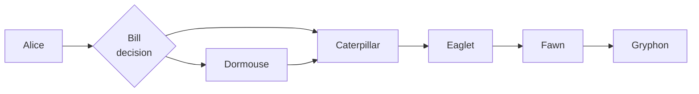
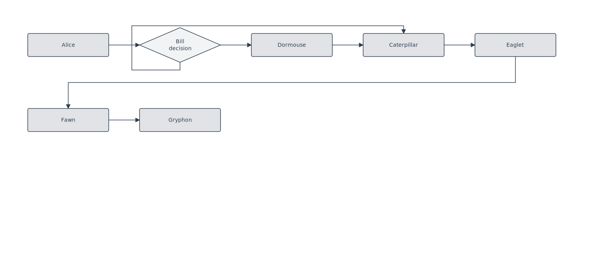

# Rule: route-around-intermediate-node

## Statement

In horizontal layouts (LR / RL), a forward same-row edge whose straight-line path would cross the interior of a non-endpoint node gets detoured through the cross-axis face: src **Bottom**, tgt **Top**. The detour routes through the gutter below the source row instead of slicing through the intermediate node.

The rule fires only when (a) source and target are on the **same row** (`|dy| ≤ 40 px`), (b) **both endpoints are at the root level** (cluster-internal edges have their own routing constraints), and (c) **at least one non-endpoint node sits in the edge's x-strip with overlapping y**.

## Rationale

The canonical case is a decision diamond with a re-merge:

```
[H] → [SUM] → [COMPRESS] → [PASS]
        ↓___________________↑   (skip-rank edge)
```

Layered placement puts `SUM` at column 1, `COMPRESS` at column 2, `PASS` at column 3. `SUM` has two outgoing edges — one to `COMPRESS` (adjacent), one to `PASS` (skips column 2). `applyDecisionNodeConvention` places both on `SUM`'s Right face, and port distribution gives them slightly different y ratios, but they both still run horizontally across the row at the shared centerline. The longer one slices through `COMPRESS`.

The router has no obstacle awareness — it draws the polyline between source and target ports based on alignment, no spatial reasoning about what's in between. Rather than retrofit obstacle-aware orthogonal routing onto the whole system, this rule catches the specific case at port-assignment time: detect the obstacle, switch the edge to a Bottom → Top detour. The polyline then drops into the gutter, runs across to the target's column, and rises into the target from above.

Why a separate rule from `back-edge-gutter-routing` and `fork-cross-row-perpendicular-exit`: those flip faces based on the edge's *topology* (back-edge classification, or fork + cross-row). This one flips based on *spatial collision* in the laid-out diagram. The trigger and the fix are different; only the gutter routing they produce is shared.

## Example





`Bill` is the decision diamond. `Bill → Dormouse` is an adjacent-column edge, stays on Right → Left. `Bill → Caterpillar` skips `Dormouse`'s column. The route-around rule detects `Dormouse` in the edge's x-strip at the same row's center y and switches the edge to Bottom → Top — the detour dips below the row, runs right to `Caterpillar`'s column, and rises into `Caterpillar`'s top.

(The fixture needs 7 nodes total to trigger row wrap and flatten all 5 row-0 columns onto a shared y. Without wrap, filigree "branches up" `Dormouse` to a different y, and `Bill → Caterpillar` isn't a same-row skip anymore.)

## Test

- Fixture: [`packages/doodles-svg/test/golden/fixtures/lr-fork-skip-rank.mmd`](../../packages/doodles-svg/test/golden/fixtures/lr-fork-skip-rank.mmd)
- Describe block: `golden: lr-fork-skip-rank` in `golden.test.ts`
- Key assertions:
  - `loaded.L.edge({fromText: "Bill", toText: "Caterpillar"}).doesNotCross("Dormouse");`
  - `loaded.L.edge({fromText: "Bill", toText: "Caterpillar"}).hasSourceAlignment(PortAlignment.Bottom).hasTargetAlignment(PortAlignment.Top);`
  - `loaded.L.edge({fromText: "Bill", toText: "Dormouse"}).hasSourceAlignment(PortAlignment.Right).hasTargetAlignment(PortAlignment.Left);` — adjacent branch unchanged.

## Implementation

`routeAroundIntermediateNodes` in [`packages/doodles-layout/src/structureRelayout.ts`](../../packages/doodles-layout/src/structureRelayout.ts), run after `applyCrossRowForkExit` and before `applyCrossClusterExitFace`. For every edge currently on the in-flow face (Right/Left for LR/RL) with `|dy| ≤ CROSS_ROW_DY_THRESHOLD_PX`, scans all other nodes for x-bbox overlap with the edge's x-strip AND y-bbox overlap with the edge's centerline. If any non-endpoint node hits, flips to Bottom → Top.

## Limits

- **Cluster-internal or cross-cluster edges**: skipped. Cluster routing has its own obstacle handling via `applyCrossClusterExitFace`; preemptive detours here cause same-source crossings inside cluster fanouts.
- **TB / BT layouts**: rule doesn't fire. A parallel "column-obstacle detour" hasn't surfaced as a bug yet — file a new rule if it does.
- **Cross-row edges**: skipped. Already covered by `back-edge-gutter-routing` and `fork-cross-row-perpendicular-exit`.
- **Choice of detour direction**: always Bottom → Top. Going Top would route through the gutter above the source row, which is exterior space when the source is on row 0 (the typical case). If a future graph needs the opposite direction, the rule will need a "which gutter has space" check.
