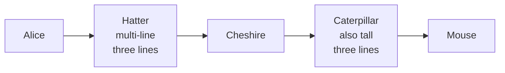
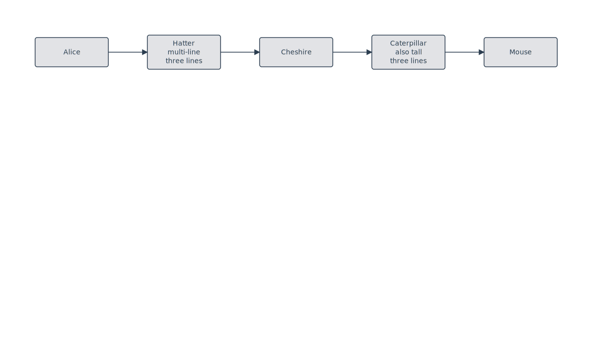

# Rule: row-center-align-by-height

## Statement

In horizontal layouts (LR / RL), once row membership is fixed by upstream passes (filigree layering, row wrap, linear-tail pinning), every node in the same visual row shifts vertically so its **center** matches the row's centerline. The centerline is the row's top y plus half the tallest member's height.

For a row of uniform-height nodes the rule is a no-op. For mixed-height rows (multi-line label next to single-line ones), short nodes get pushed down by half the height delta. Tall nodes don't move.

The rule does not apply to TB / BT layouts (edges flow vertically there; node centerlines are an x-axis concern, not y).

## Rationale

ELK's Brandes-Köpf placer (filigree's default) **top-aligns** nodes within a layer. When labels vary in line count, multi-line labels grow downward only, so their geometric centers sit lower than their single-line neighbors'. A Right→Left edge between them attaches at each side's left/right midpoint (port ratio 0.5 → port y = node center) — but the two midpoints are at different y values. The router responds with a 4-segment polyline that has a small vertical jog in the middle of what should be a straight horizontal.

The reader registers the kink as *"something is broken about this edge."* It isn't — the polyline is geometrically correct given the port positions — but the visual semantics of "these two boxes are at the same level" are violated. Aligning centers restores the semantics: nodes look like they're on the same row, and the ports default to a shared y, so the router emits a straight 2-point segment.

This is the Graphviz approach (see [comparison of tool behaviors below](#how-other-tools-handle-this)). It's the cheapest fix that doesn't change node sizes (the alternative — padding shorter nodes to match the tallest — wastes vertical space) and doesn't shift port positions off-center (the alternative — sliding the port along the node's edge to meet the neighbor's center — produces visibly asymmetric ports on tall nodes).

## Example

`Hatter` and `Caterpillar` have 3-line labels (height 70 px). `Alice`, `Cheshire`, and `Mouse` have single-line labels (height 60 px). After the rule fires, all five centers sit at y=83. Each edge is a clean 2-point horizontal at the centerline.

## Test

- Fixture: [`packages/doodles-svg/test/golden/fixtures/lr-row-mixed-heights.mmd`](../../packages/doodles-svg/test/golden/fixtures/lr-row-mixed-heights.mmd)
- Describe block: `golden: lr-row-mixed-heights` in `golden.test.ts`
- Key assertions:
  - `loaded.L.nodes("Alice", "Hatter", "Cheshire", "Caterpillar", "Mouse").sameRow(1);` *(1 px tolerance — strict)*
  - Source port y values match across the chain (every edge is a single straight segment)

## Implementation

`centerAlignRowsByHeight` in [`packages/doodles-layout/src/structureRelayout.ts`](../../packages/doodles-layout/src/structureRelayout.ts), run after `alignChainsToForkRow` and before `adjustPortAlignments`. Groups nodes by top y with `ROW_GROUP_TOLERANCE_PX = 5` (linear-tail and wrap pin to exact y; tolerance soaks up sub-pixel drift), then for each row of ≥ 2 members with non-uniform heights, shifts each node so `bounds.y = rowCenterY - bounds.height / 2`.

## How other tools handle this

The same problem has five known solutions in the wild:

1. **Uniform-size** — resize every node to the row's max height. Padding wastes space but every edge is straight for free. Recommended UX practice in most flowchart style guides.
2. **Center-aligned rows (this rule)** — keep heights, shift y by half the height delta. Graphviz default.
3. **Smart port placement** — keep heights and top-y, but slide the port along the node's edge to land at the neighbor's center. yFiles `OrthogonalEdgeRouter` does this with port candidates.
4. **Stretchy nodes** — grow shorter nodes vertically until edges straighten. ELK's `nodeFlexibility = NODE_SIZE` setting.
5. **Fixed midpoint ports** — accept the kink, let users drag waypoints manually. Lucidchart and Visio do this; users complain.

(2) was chosen because it's a 30-line post-pass, doesn't touch the placer or router, and produces the layout readers already expect from any well-drawn flowchart.

## Limits

- **Cluster members**: excluded from row grouping (they're constrained by the cluster bbox). The rule only operates on root-level nodes.
- **TB / BT layouts**: rule doesn't fire. Column-center alignment by width is a parallel concern that hasn't surfaced as a bug yet — file a new rule when it does.
- **Rows of one node**: skipped (nothing to align against).
- **Uniform-height rows**: skipped (no-op for the common case).
