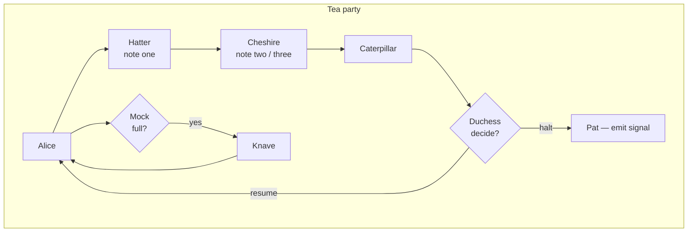
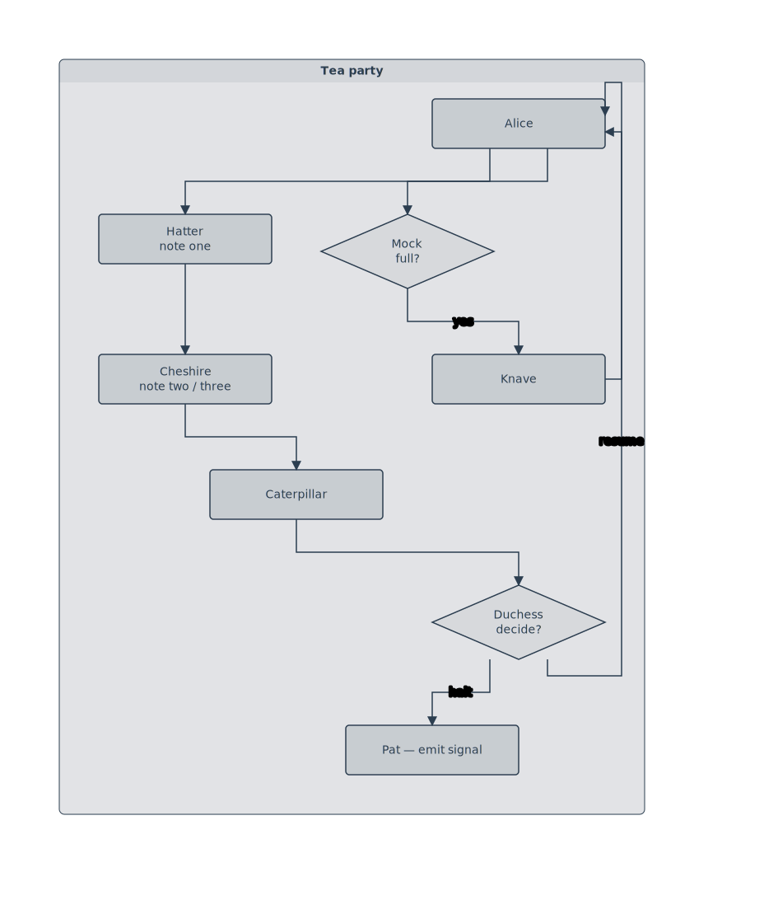

# Rule: tb-back-edge-side-gutter

## Statement

In vertical layouts (TB / BT), back-edges and visually-back forward edges (column-wrapped) route through the gutter **beside** the source column, never through the interior of the cluster.

Port assignment by `dx = target.x − source.x`:
- **Same column** (`|dx| ≤ threshold`): src **Right**, tgt **Right**. The edge steps out into the gutter to the right of the column and rises (or falls) back to the target.
- **Target right of source** (`dx > threshold`): src **Right**, tgt **Left**. The edge uses the gutter *between* the source column and the target column.
- **Target left of source** (`dx < −threshold`): src **Left**, tgt **Right**. Uses the gutter from the other direction.

This rule is the TB/BT mirror of [back-edge-gutter-routing](./back-edge-gutter-routing.md): rows ↔ columns, the side gutters ↔ the row gutters. The earlier rule's "Limits" section called the TB case out as not-yet-covered; this rule covers it.

## Rationale

When a reader scans a vertical flowchart left-to-right within a row and top-to-bottom across rows, **the interior of the cluster is the surface of the forward flow** — every column is occupied by a node, and a vertical line drawn between columns reads as either an in-flow edge or, if it's a back-edge, a wire snaking between nodes. The previous port assignment (`src Top, tgt Left`) drew back-edges through those interior columns, which is where intermediate nodes live; the polyline ended up slicing through whichever node happened to sit between source and target.

The side gutter — the strip of pixels between the rightmost column and the cluster border — is exterior to the forward flow. Routing back-edges there gives them a clear, unobstructed channel that reads as "this wire goes back via the margin" without colliding with any in-flow node.

Two routing pathologies this prevents:
1. **Slices-through-intermediate-node** for back-edges from a decision diamond. With `src Bottom` (decision convention override) and `tgt Left`, the cross-axis L-detour put the long vertical leg at `tgt.x − padding`, which is inside the cluster's column band — and intermediate nodes whose x-range overlaps that band get cut.
2. **Corner-inside-target** for back-edges from a non-decision node sharing the target's column. With `src Top, tgt Left`, the cross-axis elbow at `(from.x, to.y)` landed inside the target's own bbox when source and target shared a column.

## Example

Two back-edges close cycles back to Alice. Both rise via the **right** side gutter:
- `Duchess → Alice` ("resume"): Duchess is a decision diamond, so the decision-node convention pins its outgoing face to Bottom. With `tgt Right` from this rule, the route exits Duchess downward, sweeps right past the cluster's right column at `x = max(srcRight, tgtRight) + pad`, and rises into Alice's right face.
- `Knave → Alice`: same column as Alice. Both faces are Right (same-face detour), and the U traverses above both nodes via the right-gutter outerX, entering Alice's right face perpendicularly.

Neither polyline touches Mock, Hatter, Cheshire, or Caterpillar — they all live in the interior columns and would have been sliced under the old `tgt Left` assignment.

## Tests

- Fixture: [`packages/doodles-svg/test/golden/fixtures/tb-back-edge-through-cluster.mmd`](../../packages/doodles-svg/test/golden/fixtures/tb-back-edge-through-cluster.mmd)
- Describe block: `golden: tb-back-edge-through-cluster` in `golden.test.ts`
- Key assertions:
  - `loaded.L.edges().noNodeIntersection();`
  - `loaded.L.edge({fromText: "Duchess", toText: "Alice"}).doesNotCross("Hatter", "Cheshire", "Caterpillar");`
  - `loaded.L.edge({fromText: "Knave", toText: "Alice"}).doesNotCross("Mock");`

## Implementation

`tbBackEdgeFaces(dx)` in [`packages/doodles-layout/src/structureRelayout.ts`](../../packages/doodles-layout/src/structureRelayout.ts). The vertical branch of `adjustPortAlignments` calls this for back-edges (`forward === false`) instead of the previous hard-coded `tgt = Left`. The threshold `CROSS_COL_DX_THRESHOLD_PX = 100` (roughly half a typical node width) decides "same column" vs "different column."

The edge router (`routing.ts`) was unchanged — the existing `sameFaceDetour(Right)` and `crossAxisBackEdgeDetour` handle these face pairs correctly once the assignment is right.

## Anti-example

Before this rule, the same fixture rendered with `Duchess → Alice` (resume) and `Knave → Alice` both entering Alice's Left face. The long vertical leg of each polyline sat at `x = Alice.x − pad`, which lies inside Mock's x-range — both back-edges sliced through the Mock diamond and through Alice itself on the entry approach. Visually: two edges drawn straight across the middle of the interior, cutting through nodes they had no logical relationship to.
